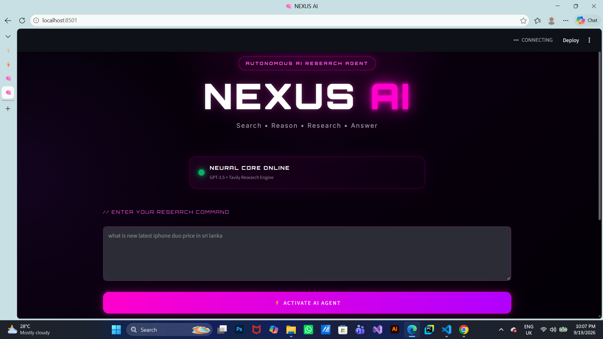

# 🤖 NEXUS AI — End-to-End AI Research Agent

<p align="center">


</p>

<p align="center">
  <strong>
    An end-to-end AI research agent that searches the web, reasons over retrieved information, and generates intelligent research-based answers using LangChain, OpenAI, and Tavily.
  </strong>
</p>

<p align="center">

🧑‍💻 <strong>User Query</strong> → 🤖 <strong>AI Agent</strong> → 🔎 <strong>Web Search</strong> → 🧠 <strong>Reasoning</strong> → 💬 <strong>Answer</strong>

</p>

---

## 📌 Overview

**NEXUS AI** is an end-to-end AI research agent built using **LangChain**, **OpenAI GPT-3.5-turbo**, and **Tavily Search**.

The application allows users to provide natural-language research questions. The AI agent determines when web search is required, uses the Tavily search tool to retrieve relevant information, processes the retrieved information using an LLM, and generates a final response.

The project demonstrates how an **LLM-powered autonomous agent** can interact with external tools instead of simply generating answers from its internal knowledge.

The application also includes a modern **Streamlit-based cyberpunk interface** designed to visualize the agent's research workflow.

The main goal of this project is to demonstrate an end-to-end **AI Agent architecture** using tool calling, web search, LLM reasoning, environment-variable security, and a user-friendly frontend.

---

## ✨ Features

* 🤖 AI-powered autonomous research agent
* 🧠 LangChain ReAct agent architecture
* 🔎 Real-time web search using Tavily
* 🌐 Research current web information
* 💬 Natural-language user queries
* 🧩 Tool-using AI agent
* ⚡ OpenAI GPT-3.5-turbo integration
* 🌐 Streamlit web application
* 🎨 Modern futuristic cyberpunk UI
* 💗 Neon pink/purple interface
* 🧠 AI agent activity animation
* 🔐 Environment-variable based API key configuration
* 🛡️ `.env` protection using `.gitignore`
* ⚙️ Configurable Tavily search results
* 🚨 Error handling for agent execution
* 🔄 Agent iteration control
* 📊 End-to-end research workflow
* 🧪 Practical Generative AI application
* 🚀 Portfolio-ready AI Agent project

---

# 🎥 User Interface

The NEXUS AI interface provides a futuristic environment for interacting with the AI research agent.

Users can enter a research question and activate the agent.

The application then displays an AI processing state while the research workflow is executed.

<p align="center">
  
</p>

### Example Interface

```text
┌──────────────────────────────────────────────────────┐
│                                                      │
│              AUTONOMOUS AI RESEARCH AGENT            │
│                                                      │
│                     NEXUS AI                         │
│                                                      │
│          Search • Reason • Research • Answer         │
│                                                      │
├──────────────────────────────────────────────────────┤
│                                                      │
│  🧠 NEURAL CORE ONLINE                               │
│  GPT-3.5 + Tavily Research Engine                    │
│                                                      │
│  Enter your research command                         │
│                                                      │
│  ┌──────────────────────────────────────────────┐    │
│  │ Ask anything you want me to research...     │    │
│  └──────────────────────────────────────────────┘    │
│                                                      │
│          ⚡ ACTIVATE AI AGENT                        │
│                                                      │
└──────────────────────────────────────────────────────┘
```

---

# 🎬 Project Demo

The project includes a demonstration video showing the NEXUS AI interface and the complete AI research workflow.

<p align="center">

**🎥 Demo:** `assets/demo.mp4`

</p>

The demonstration shows:

```text
User Research Query
        ↓
AI Agent Activation
        ↓
Agent Processing
        ↓
Tavily Web Search
        ↓
Information Processing
        ↓
LLM Reasoning
        ↓
Final Research Answer
```

---

# 🏗️ System Architecture

```text
                         ┌─────────────────────┐
                         │        User         │
                         │   Research Query    │
                         └──────────┬──────────┘
                                    │
                                    ▼
                         ┌─────────────────────┐
                         │    Streamlit UI     │
                         │      NEXUS AI       │
                         └──────────┬──────────┘
                                    │
                                    ▼
                         ┌─────────────────────┐
                         │   LangChain Agent   │
                         │    ReAct Agent      │
                         └──────────┬──────────┘
                                    │
                       ┌────────────┴────────────┐
                       │                         │
                       ▼                         ▼
              ┌─────────────────┐      ┌─────────────────┐
              │   OpenAI LLM     │      │  Tavily Search  │
              │ GPT-3.5-Turbo    │      │      Tool       │
              └────────┬────────┘      └────────┬────────┘
                       │                         │
                       │        Search Results   │
                       │◄────────────────────────┘
                       │
                       ▼
              ┌─────────────────────┐
              │ Agent Reasoning &   │
              │ Tool Execution      │
              └──────────┬──────────┘
                         │
                         ▼
              ┌─────────────────────┐
              │   Final AI Answer   │
              └──────────┬──────────┘
                         │
                         ▼
              ┌─────────────────────┐
              │   Streamlit Output  │
              │       💬 Answer     │
              └─────────────────────┘
```

---

# 🔄 How It Works

The application follows an agent-based research workflow.

### 1️⃣ User Enters a Query

The user provides a natural-language research question through the Streamlit interface.

Example:

```text
What is the latest price of the iPhone 18 Pro Max in Sri Lanka?
```

---

### 2️⃣ LangChain Agent Receives the Query

The query is passed to the LangChain `AgentExecutor`.

The agent uses an OpenAI language model to determine how the question should be handled.

---

### 3️⃣ Agent Determines Whether a Tool Is Required

The ReAct agent can decide to use the available Tavily search tool when external information is required.

```text
User Query
    ↓
LLM
    ↓
Does external information help?
    ↓
Yes
    ↓
Tavily Search
```

---

### 4️⃣ Tavily Performs Web Search

The Tavily Search tool searches the web and returns relevant search results to the agent.

The application is configured with:

```python
TavilySearchResults(max_results=2)
```

---

### 5️⃣ Agent Processes the Search Results

The retrieved information is returned to the LangChain agent.

The LLM uses the available information to construct a response.

---

### 6️⃣ Final Answer Is Generated

The agent produces a final natural-language response.

```text
Search Results
      ↓
LLM Processing
      ↓
Final Answer
```

---

### 7️⃣ Streamlit Displays the Result

The final answer is displayed inside the NEXUS AI interface.

---

# 🧠 AI Agent Pipeline

```text
                  USER QUERY
                      │
                      ▼
             ┌─────────────────┐
             │  LangChain Agent│
             └────────┬────────┘
                      │
                      ▼
             ┌─────────────────┐
             │ OpenAI GPT-3.5  │
             │     Turbo       │
             └────────┬────────┘
                      │
              ┌───────┴────────┐
              │                │
              ▼                ▼
         Direct Answer     Use Tool
                               │
                               ▼
                       ┌───────────────┐
                       │ Tavily Search │
                       └───────┬───────┘
                               │
                               ▼
                        Search Results
                               │
                               ▼
                       LLM Processing
                               │
                               ▼
                         Final Answer
```

---

# 🔁 ReAct Agent Workflow

The project uses the **ReAct agent architecture** provided by LangChain.

The basic concept is:

```text
Reason
  ↓
Choose Action
  ↓
Execute Tool
  ↓
Observe Result
  ↓
Reason Again
  ↓
Generate Final Answer
```

Conceptually:

```text
Question
   ↓
Thought
   ↓
Action
   ↓
Tavily Search
   ↓
Observation
   ↓
Thought
   ↓
Final Answer
```

This allows the application to combine an LLM with an external research tool.

---

# 🛠️ Technologies Used

| Technology              | Purpose                         |
| ----------------------- | ------------------------------- |
| 🐍 Python               | Core programming language       |
| 🦜 LangChain            | AI agent framework              |
| 🤖 OpenAI GPT-3.5-Turbo | Large Language Model            |
| 🔎 Tavily               | Web search and research         |
| 🌐 Streamlit            | Web application interface       |
| 🧠 ReAct Agent          | Agent reasoning architecture    |
| 🧰 LangChain Hub        | ReAct prompt                    |
| 🔐 python-dotenv        | Environment variable management |
| 🛡️ certifi             | SSL certificate configuration   |
| 🧰 Git                  | Version control                 |
| 🐙 GitHub               | Source code hosting             |

---

# 📦 Main Python Libraries

The project uses the following main packages:

```text
langchain
langchain-community
langchain-core
langchain-openai
tavily-python
python-dotenv
langchainhub
streamlit
certifi
requests
```

---

# 📁 Project Structure

```text
End-To-End-Single-AI-Agent-System-Using-LangChain/
│
├── app.py
├── main.py
├── requirements.txt
├── .gitignore
├── README.md
│
├── assets/
│   ├── ui-screenshot.png
│   └── demo.mp4
│
├── research/
│   └── agent_demo.ipynb
│
└── singleagent/
    └── ...              # Local virtual environment - NOT committed
```

### Important

The `singleagent/` virtual environment is intentionally excluded from GitHub.

API credentials are also excluded using `.gitignore`.

---

# ⚙️ Installation

## 1️⃣ Clone the Repository

```bash
git clone <YOUR_GITHUB_REPOSITORY_URL>
```

Navigate into the project:

```bash
cd End-To-End-Single-AI-Agent-System-Using-LangChain
```

---

## 2️⃣ Create a Virtual Environment

### Windows

```bash
python -m venv venv
```

Activate it:

```bash
venv\Scripts\activate
```

### macOS / Linux

```bash
python3 -m venv venv
```

Activate it:

```bash
source venv/bin/activate
```

---

## 3️⃣ Install Dependencies

```bash
pip install -r requirements.txt
```

---

# 🔐 Environment Variables

Create a `.env` file in the project root:

```text
OPENAI_API_KEY=your_openai_api_key
TAVILY_API_KEY=your_tavily_api_key
```

The application loads these credentials using:

```python
from dotenv import load_dotenv

load_dotenv()
```

The API keys are then retrieved using environment variables:

```python
OPENAI_API_KEY = os.getenv("OPENAI_API_KEY")
TAVILY_API_KEY = os.getenv("TAVILY_API_KEY")
```

---

## 🔒 Security

**Never commit your `.env` file to GitHub.**

The project `.gitignore` includes:

```gitignore
.env
.env.*
**/.env
**/.env.*
```

The local virtual environment is also ignored:

```gitignore
singleagent/
venv/
.venv/
env/
```

Never expose API keys inside:

* `app.py`
* `main.py`
* `README.md`
* Jupyter notebooks
* Screenshots
* Demo videos
* Git commits
* Public repositories

If an API key is accidentally exposed, revoke it and create a new key.

---

# ▶️ Run the Application

After installing the dependencies and configuring your environment variables, run:

```bash
streamlit run app.py
```

Streamlit will provide a local URL in the terminal.

Open the URL in your browser.

---

# 💬 Example Research Queries

The agent can handle research-style questions such as:

```text
What is the capital of Sri Lanka?
```

```text
What are the latest developments in artificial intelligence?
```

```text
Compare the latest Apple and Samsung flagship smartphones.
```

```text
What are the current trends in Generative AI?
```

```text
Explain the latest developments in autonomous AI agents.
```

The agent can use Tavily Search when web research is required.

---

# 🧪 Example Agent Execution

Example:

```text
User:
What are the latest developments in Generative AI?
```

The workflow becomes:

```text
                 User Query
                     │
                     ▼
              LangChain Agent
                     │
                     ▼
               OpenAI LLM
                     │
                     ▼
              Tavily Search
                     │
                     ▼
              Search Results
                     │
                     ▼
              Agent Processing
                     │
                     ▼
               Final Answer
```

---

# 🤖 LangChain Agent Implementation

The project creates a ReAct agent using LangChain:

```python
from langchain import hub
from langchain.agents import create_react_agent, AgentExecutor

prompt = hub.pull("hwchase17/react")

agent = create_react_agent(
    llm,
    tools,
    prompt
)

agent_executor = AgentExecutor(
    agent=agent,
    tools=tools,
    verbose=True,
    handle_parsing_errors=True,
    max_iterations=5
)
```

This connects:

```text
LLM
 +
Prompt
 +
Tools
 =
AI Agent
```

---

# 🔎 Tavily Search Integration

The project uses Tavily as the web research tool:

```python
from langchain_community.tools.tavily_search import TavilySearchResults

search_tool = TavilySearchResults(
    max_results=2
)
```

The search tool allows the agent to retrieve information from the web when required.

---

# 🧠 OpenAI Integration

The project uses the LangChain OpenAI integration:

```python
from langchain_openai import ChatOpenAI

llm = ChatOpenAI(
    model="gpt-3.5-turbo",
    temperature=0,
    api_key=OPENAI_API_KEY
)
```

The model is configured with:

```text
Model:
GPT-3.5-Turbo

Temperature:
0

Purpose:
AI reasoning and response generation
```

---

# 🌐 Streamlit Frontend

The frontend is built using **Streamlit**.

The interface includes:

* 🧠 AI agent status
* 🔎 Research command input
* ⚡ Agent activation button
* ⏳ AI processing animation
* 💬 Final answer display
* 🎨 Cyberpunk-inspired visual design

The interface uses custom HTML and CSS to create the NEXUS AI visual experience.

---

# 🎨 User Experience

The interface was designed around a futuristic AI research system concept.

The visual design includes:

```text
Cyberpunk UI
      +
Neon Pink
      +
Purple Glow
      +
Glassmorphism
      +
AI Activity Animation
      +
Research Interface
```

The goal is to make the application feel like an interactive AI research system rather than a basic chatbot interface.

---

# 🧩 Error Handling

The agent includes error handling for parsing and execution problems.

```python
AgentExecutor(
    agent=agent,
    tools=tools,
    verbose=True,
    handle_parsing_errors=True,
    max_iterations=5
)
```

This helps prevent the application from failing immediately when the agent encounters an output-parsing problem.

---

# 📊 Agent Execution Control

The application limits the number of agent iterations:

```python
max_iterations=5
```

This provides a safety mechanism against unnecessarily long agent execution loops.

---

# 🔐 SSL Configuration

The project uses `certifi` to configure SSL certificate handling:

```python
import certifi

os.environ["SSL_CERT_FILE"] = certifi.where()
```

This helps provide a valid certificate bundle for HTTPS communication in the development environment.

---

# 💡 Example End-to-End Workflow

```text
1. User opens NEXUS AI
        ↓
2. User enters a research question
        ↓
3. User clicks "ACTIVATE AI AGENT"
        ↓
4. Streamlit starts the agent
        ↓
5. LangChain sends the query to the ReAct agent
        ↓
6. OpenAI processes the query
        ↓
7. Agent decides whether Tavily search is required
        ↓
8. Tavily searches the web
        ↓
9. Search results are returned
        ↓
10. LLM processes the retrieved information
        ↓
11. Agent generates the final response
        ↓
12. Streamlit displays the answer
```

---

# 🎯 Project Objectives

The main objectives of this project were to:

* Build an end-to-end AI Agent
* Understand LangChain agent architecture
* Learn how ReAct agents work
* Integrate an LLM with external tools
* Integrate Tavily web search
* Build an autonomous research workflow
* Connect an OpenAI model to a search tool
* Build a Streamlit AI application
* Handle environment variables securely
* Implement agent execution controls
* Handle agent parsing errors
* Build a practical Generative AI application
* Create a portfolio-ready AI engineering project

---

# 📚 What I Learned

Through this project, I gained practical experience with:

## 🐍 Python

* Python application development
* Environment variables
* API integration
* Exception handling
* Modular application structure

## 🦜 LangChain

* LangChain agents
* ReAct architecture
* AgentExecutor
* Tools
* Prompt integration
* LangChain Hub
* Agent iteration control

## 🤖 Large Language Models

* OpenAI API integration
* GPT-3.5-Turbo
* LLM-based reasoning
* Temperature configuration
* LLM and tool integration

## 🔎 AI Search

* Tavily Search
* Web research tools
* Search result integration
* External information retrieval

## 🌐 Streamlit

* Streamlit application development
* User input
* Buttons
* Application state
* Custom HTML
* Custom CSS
* AI activity interfaces

## 🔐 Security

* `.env` files
* API key management
* `.gitignore`
* Virtual environment isolation
* Secure GitHub repositories

## 🧠 AI Agents

* Tool-using AI systems
* Agent reasoning workflows
* ReAct pattern
* Autonomous tool selection
* Agent execution loops

---

# 🚀 Future Improvements

Possible future improvements include:

* 🧠 Upgrade to newer OpenAI models
* 🔧 Add multiple specialized tools
* 🌐 Add additional search providers
* 📄 Add PDF/document research
* 📚 Add RAG capabilities
* 🗃️ Add vector database integration
* 🧠 Add conversational memory
* 💾 Persistent chat history
* 🔗 Add LangGraph workflows
* 👥 Build multi-agent architecture
* 🧰 Add custom agent tools
* 📊 Add agent evaluation
* 📈 Add LangSmith observability
* ⚡ Improve response latency
* 💰 Add token and cost monitoring
* 🔐 Add authentication
* 🐳 Dockerize the application
* ☁️ Deploy to the cloud
* 🧪 Add automated testing
* 🔄 Add CI/CD

---

# 🧠 Future AI Agent Architecture

A future version could evolve from a single-agent system into a more advanced multi-agent architecture:

```text
                         ┌─────────────────────┐
                         │        User         │
                         └──────────┬──────────┘
                                    │
                                    ▼
                         ┌─────────────────────┐
                         │   Supervisor Agent  │
                         └──────────┬──────────┘
                                    │
                ┌───────────────────┼───────────────────┐
                │                   │                   │
                ▼                   ▼                   ▼
       ┌────────────────┐  ┌────────────────┐  ┌────────────────┐
       │ Research Agent │  │  RAG Agent     │  │ Analysis Agent │
       └───────┬────────┘  └───────┬────────┘  └───────┬────────┘
               │                   │                   │
               ▼                   ▼                   ▼
          Web Search          Vector DB             Data Tools
               │                   │                   │
               └───────────────────┼───────────────────┘
                                   │
                                   ▼
                         ┌─────────────────────┐
                         │   Response Agent    │
                         └──────────┬──────────┘
                                    │
                                    ▼
                              Final Answer
```

This architecture could later be implemented using **LangGraph**, specialized tools, memory, evaluation, and observability.

---

# 🏭 Production Improvements

For a production-ready version, the application could be extended with:

```text
                    ┌──────────────────────┐
                    │      Frontend        │
                    │   Streamlit / Web    │
                    └──────────┬───────────┘
                               │
                               ▼
                    ┌──────────────────────┐
                    │    FastAPI Backend   │
                    └──────────┬───────────┘
                               │
                  ┌────────────┼────────────┐
                  │            │            │
                  ▼            ▼            ▼
           ┌────────────┐ ┌──────────┐ ┌─────────────┐
           │ OpenAI API │ │ Tavily   │ │ Vector DB   │
           │    LLM     │ │ Search   │ │   / RAG     │
           └────────────┘ └──────────┘ └─────────────┘
                  │            │            │
                  └────────────┼────────────┘
                               │
                               ▼
                    ┌──────────────────────┐
                    │   LangGraph Agent    │
                    │  Workflow / Memory   │
                    └──────────┬───────────┘
                               │
                               ▼
                    ┌──────────────────────┐
                    │ Monitoring / Eval     │
                    │      LangSmith       │
                    └──────────────────────┘
```

Potential production technologies:

* FastAPI
* Docker
* PostgreSQL
* Redis
* Vector databases
* LangGraph
* LangSmith
* Cloud deployment
* Authentication
* Rate limiting
* Logging
* Monitoring
* Automated testing
* CI/CD
* Cost monitoring
* Evaluation pipelines

---

# 🔒 Security Considerations

API credentials should never be committed to GitHub.

Use:

```text
OPENAI_API_KEY=your_openai_api_key
TAVILY_API_KEY=your_tavily_api_key
```

and protect them using `.gitignore`:

```gitignore
.env
.env.*
**/.env
**/.env.*
```

The local Python virtual environment should also remain outside the repository:

```gitignore
singleagent/
venv/
.venv/
env/
```

Never expose API keys inside:

* Source code
* README files
* Jupyter notebooks
* Screenshots
* Demo videos
* Git commits
* Public repositories

If a key is accidentally exposed, revoke it immediately and generate a replacement.

---

# ⭐ Project Highlights

### 🤖 Autonomous AI Research

Uses an LLM-powered agent to perform research using external tools.

### 🔎 Web Search

Uses Tavily to retrieve current information from the web.

### 🦜 LangChain Agent

Uses LangChain's ReAct agent architecture for tool-based reasoning.

### 🧠 Large Language Model

Uses OpenAI GPT-3.5-Turbo for language understanding and response generation.

### 🌐 Streamlit Application

Provides an interactive browser-based interface.

### 🎨 Modern AI Interface

Includes a futuristic NEXUS AI cyberpunk design with neon visual effects.

### 🔐 Secure Configuration

Uses environment variables for API credentials.

### 🧩 End-to-End AI Agent

```text
User
 ↓
Streamlit UI
 ↓
LangChain Agent
 ↓
OpenAI LLM
 ↓
Tavily Search
 ↓
Search Results
 ↓
LLM Processing
 ↓
Final Answer
 ↓
Streamlit UI
```

---

# 📌 Repository

This project is available as a public GitHub portfolio project.

Repository:

```text
End-To-End-Single-AI-Agent-System-Using-LangChain
```

---

# 👨‍💻 Author

**Sudeera Attanayake**

AI Engineer in Training | Generative AI | Machine Learning | Python | AI Agents

Interested in building practical:

```text
Artificial Intelligence
        +
Generative AI
        +
LLM Applications
        +
AI Agents
        +
Machine Learning
        +
Production AI Systems
```

---

# 📄 License

This project was created for **educational, learning, and portfolio purposes**.

You may modify and extend the project for your own learning and development.

---

# 🤝 Support

If you find this project useful:

⭐ Star the repository
🍴 Fork the repository
🐛 Report issues
💡 Suggest improvements
📚 Use it for learning

---

# 🎯 Conclusion

The **NEXUS AI — End-to-End AI Research Agent** project demonstrates how a Large Language Model can be connected with external tools to create a practical AI Agent.

The project combines:

```text
🐍 Python
      +
🦜 LangChain
      +
🤖 OpenAI GPT-3.5-Turbo
      +
🔎 Tavily Search
      +
🌐 Streamlit
      +
🧠 ReAct Agent
      +
🔐 Secure API Configuration
      =
🚀 AI-Powered Research Agent
```

This project represents a practical step toward building more advanced **Generative AI, LLM, RAG, and Agentic AI systems**.

Future versions can extend the architecture with **LangGraph, multi-agent workflows, RAG, memory, evaluation, observability, FastAPI, databases, and cloud deployment**.

---

<p align="center">

<strong>Built with 🐍 Python + 🦜 LangChain + 🤖 OpenAI + 🔎 Tavily + 🌐 Streamlit</strong>

</p>

<p align="center">

⭐ If you like this project, consider giving it a star!

</p>
